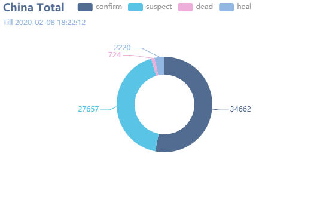
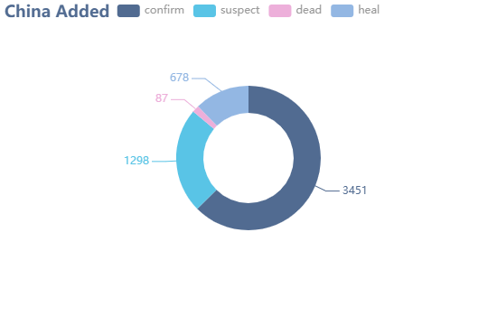
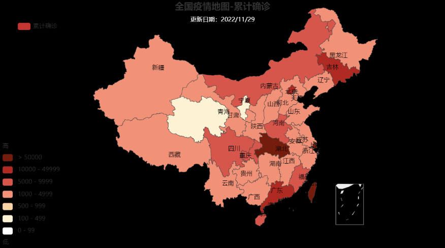
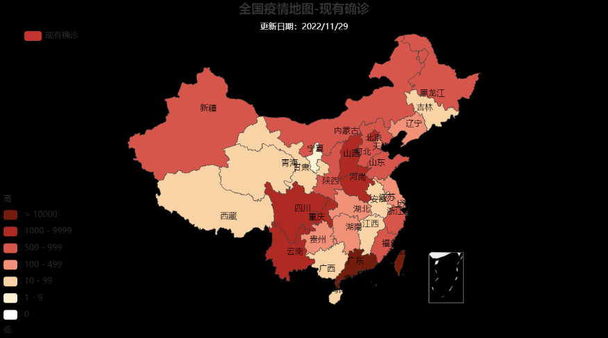
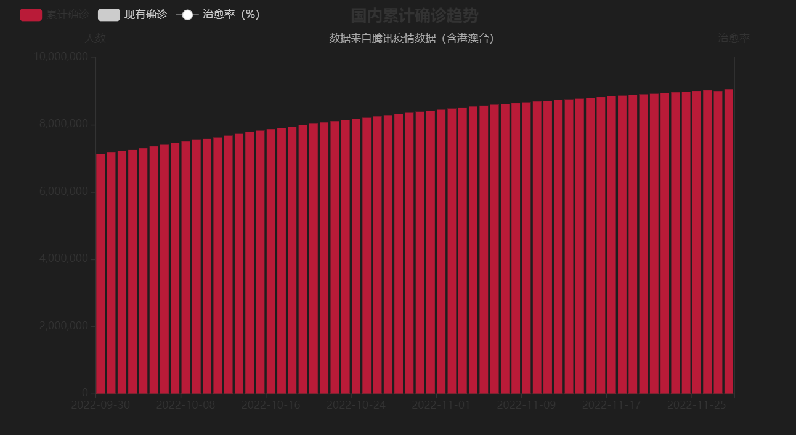
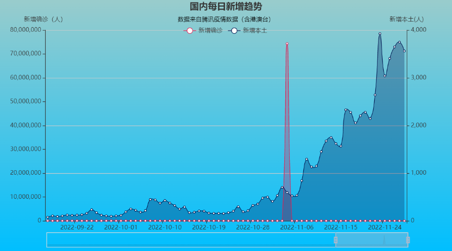
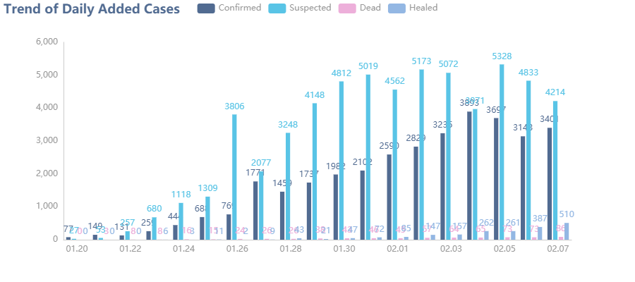

# 2019-nCoV Dashboard with Pyecharts
2019-nCoV Desease Trending with Pyecharts library from Baidu.com

## 0. Preface
* Tencent weiste changed it's JSON coding since the beginning of Feb 2020.
* Dashboard with Baidu's pyecharts library - way easier than ever.
* Data souce: [Tencent Live Tracking of 2019-nCoV](https://news.qq.com/zt2020/page/feiyan.htm)

## Part 1. Data Entry

### 1.1 Load Libraries
```import time 
import json
import requests
from datetime import datetime
import pandas as pd 
import numpy as np
```
......

## Part 2. Visualization

### 2.1 China Total Detailed with Pie Charts



## 2.2 Global Heat Maps


## 2.3 China Heat Map


### 2.4 Plot Daily Trend



### 2.5 Daily Added in China (Bar Chart)


## Part 3. All-in-one Charts into Webpage
...
----
## Courtesy of Hakuna_Matata_001

* Copyrights Reserved by the CSDN Blogger - Hakuna_Matata_001.
* Abided by Copyright protocols of CC 4.0 BY-SA. 
* Please cite the article origin when quoting.

  Code of Origin: https://blog.csdn.net/weixin_43130164/article/details/104113559
  
