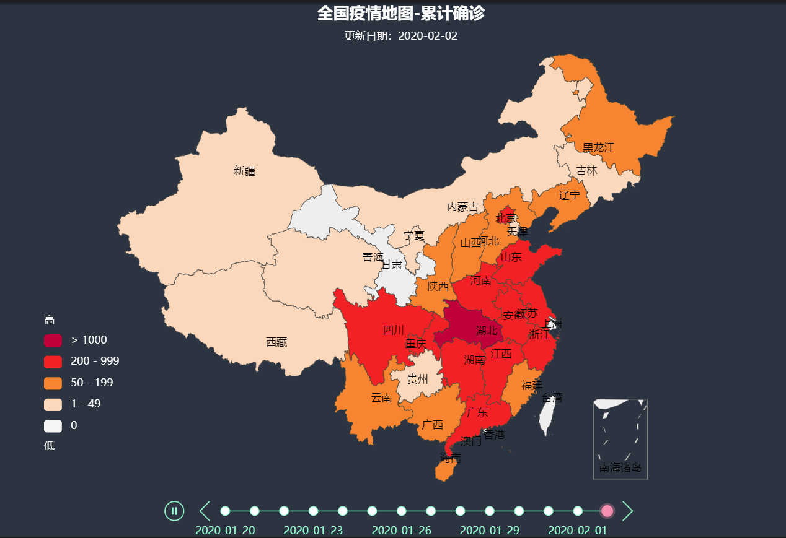

# NOTES
* Obviously **news.qq.com** diverted the data source to somewhere and swung their reporting templates and data structure quite often in the past few weeks, and most of the codes here do not work any more. 
* Need to wedge out some time pieces to cope with the new changes. It seems that the data source from Hopkins University is way better.
* Stuck in North Africa, no time and no Internet for such actions yet. Sorry to the forker(s).

# 2019-nCoV Dashboard with Pyecharts
2019-nCoV Desease Trending with Pyecharts library from Baidu.com

## 0. Preface
* Tencent weiste changed it's JSON coding since the beginning of Feb 2020.
* Dashboard with Baidu's pyecharts library - way easier than ever.
* Data souce: [Tencent Live Tracking of 2019-nCoV](https://news.qq.com/zt2020/page/feiyan.htm)

## Part 1. Web Page Analysis

Data source: https://news.qq.com/zt2020/page/feiyan.htm?from=timeline&isappinstalled=0

The Inspector tool of Chome or Firefox shall be able to help you:

\* China Domenstic Data Interface:

   https://api.inews.qq.com/newsqa/v1/query/inner/publish/modules/list?modules=

\* China Provincial Hostoric Data Interface：

   https://api.inews.qq.com/newsqa/v1/query/pubished/daily/list?adCode=

\* International Data Interface:

   https://api.inews.qq.com/newsqa/v1/automation/modules/list?modules=

## Part 2. Catch Data

### 2.1 Load Libraries
```import time 
import json
import requests
from datetime import datetime
import pandas as pd 
import numpy as np
```
......

## Part 3. Visualization

## 3.1 China Heat Map 1


## 3.2 China Heat Map 2


### 3.3 Line Chart - Daily Trend


### 3.4 Time-axis Revolver



----
## Courtesy of Hakuna_Matata_001

* Copyrights Reserved by the CSDN Blogger - Hakuna_Matata_001.
* Abided by Copyright protocols of CC 4.0 BY-SA. 
* Please cite the article origin when quoting.

  Code of Origin: https://blog.csdn.net/weixin_43130164/article/details/104113559
